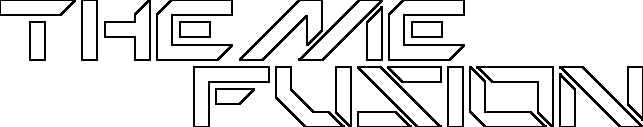

[![Make a pull request][prs-badge]][prs]

[![Watch on GitHub][github-watch-badge]][github-watch]
[![Star on GitHub][github-star-badge]][github-star]
[![Tweet][twitter-badge]][twitter]

# Introduction

Image Converter to convert bundles images to all sizes for theming in iOS

Currently support sizes:

- 60, 76, 120, 152, 180

[license]: https://github.com/maximegris/angular-electron/blob/master/LICENSE.md
[prs-badge]: https://img.shields.io/badge/PRs-welcome-brightgreen.svg?style=flat-square
[prs]: http://makeapullrequest.com
[github-watch-badge]: https://img.shields.io/github/watchers/va2ron1/themefusion.svg?style=social
[github-watch]: https://github.com/va2ron1/themefusion/watchers
[github-star-badge]: https://img.shields.io/github/stars/va2ron1/themefusion.svg?style=social
[github-star]: https://github.com/va2ron1/themefusion/stargazers
[twitter]: https://twitter.com/intent/tweet?text=Check%20out%20themefusion!%20https://github.com/va2ron1/themefusion%20%F0%9F%91%8D
[twitter-badge]: https://img.shields.io/twitter/url/https/github.com/va2ron1/themefusion.svg?style=social
